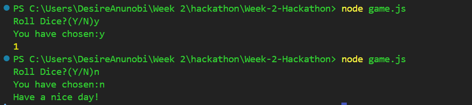
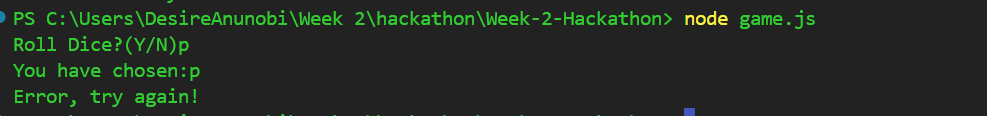
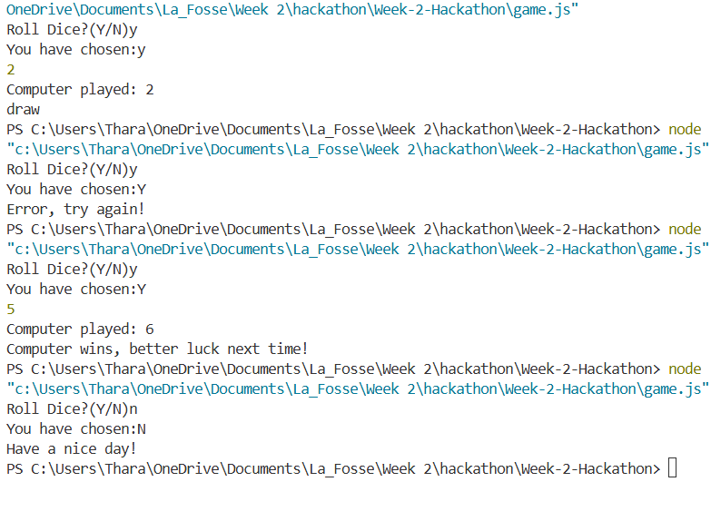

# Week-2-Hackathon

# Roll a Dice Generator

## Project description

The user is asked in terminal if they want to roll the dice.
When the user prompts 'Y' for yes, a game is started between the user and the computer. A random number from a dice will be displayed and then its the computers turn. The player with the highest roll wins. When the user prompts 'N' for no, the game ends.

### Installation & usage

Clone from Git repository or copy file.

### Technologies

- Javascript
- CLI

### Process

| Process of creating game                                                                                       |
| -------------------------------------------------------------------------------------------------------------- |
| Readline module to interact with the terminal.                                                                 |
| User prompted with "Roll Dice?(Y/N)"                                                                           |
| Converts the user’s input to lowercase.                                                                        |
| Then logs what the user entered.                                                                               |
| **If the user typed “Y” (yes), the game rolls the dice:**                                                      |
| Math.random() gives a number from 0 to 1. Multiplying by 6 gives a range of 0–5.999.                           |
| Math.ceil() rounds that up to 1–6.                                                                             |
| Random number from 1-6 id given in output.                                                                     |
| Computer plays and lets the user know whether they have won, draw or lost based on who has the highest number. |
| **If the user says no, it says 'Have a nice day!'**                                                            |
| **If the input is anything else, it shows an error message 'Error, try again!'**                               |

### Screenshots/Images

Terminal Output Part 1:

### Wins & Challenges (Code snippets)

Wins: We included if else and else if statements to set conditions for the dice output and input.

Updated Output:

Challenges:

### Bugs

- No Bugs

### Future features

- HTML
- CSS
- Convert code into functions and write tests