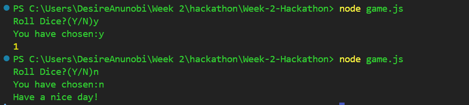
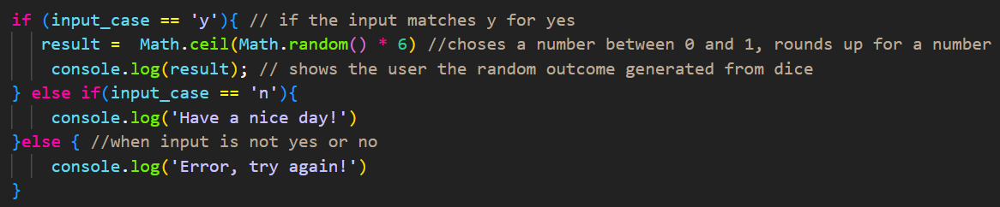

# Week-2-Hackathon

# Roll a Dice Generator

## Project description

The user is asked in terminal if they want to roll the dice.
When the user prompts 'y' for yes, a random number from a dice will be displayed and the user will be asked if they want to roll again. The user is prompted to respond with 'y' for yes or 'n' for no. 
When the user prompts 'n' for no, no number is displayed.

### Installation & usage
Clone from Git repository or copy file.

### Technologies
- Javascript
- CLI

### Process

| Process of creating game |
| --- |
| Readline module to interact with the terminal. |
| User prompted with "Roll Dice?(Y/N)" |
| Converts the user’s input to lowercase. |
| Then logs what the user entered. |
| **If the user typed “y” (yes), the game rolls the dice:** |
| Math.random() gives a number from 0 to 1. Multiplying by 6 gives a range of 0–5.999. |
| Math.ceil() rounds that up to 1–6. |
| Random number from 1-6 id given in output. |
| **If the user says no, it says 'Have a nice day!'** |
| **If the input is anything else, it shows an error message 'Error, try again!'** |

### Screenshots/Images
Terminal Output:

### Wins & Challenges (Code snippets)
Wins: We included if else and else if statements to set conditions for the dice output and input.

Challenges:

### Bugs
- No Bugs

### Future features
- HTML
- CSS